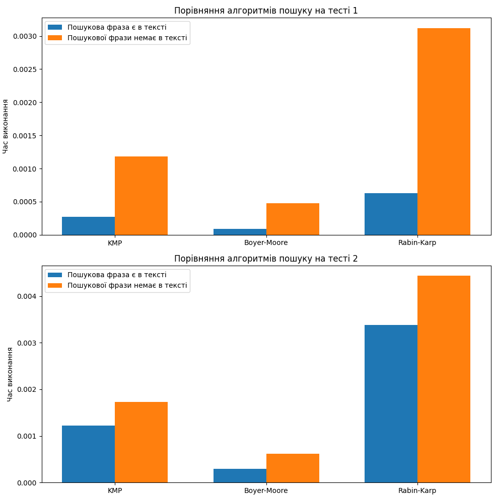

# Аналіз ефективності алгоритмів сортування

## Вступ
Цей документ містить порівняльний аналіз трьох алгоритмів пошуку: Боєра-Мура, Кнута-Морріса-Пратта та 
Рабіна-Карпа. Аналіз проведено на основі замірів часу виконання кожного алгоритму при пошуку заданої 
підстроки у наданих для тестування двох текстах.

## Методологія
Для тестування використано два текстових файли. Кожен алгоритм виконувався двічі з пошуковим запитом, який 
є у відповідному текстовому файлі та за запитом, якого немає у цьому ж файлі. Дані візуалізовано за 
допомогою стовчастих діаграм порівняння результатів.

## Результати
### Стовбчасті діаграми порівняння швидкодії різних алгоритмів пошуку.

Діаграми побудовані на емпіричних даних.  
Всі алгоритми показали однаковий патерн: час роботи алгоритму у разі знаходження підстроки є меншим за час 
роботи того ж алгоритму, коли підстрока відсутня в тексті.
Також діаграми дають можливість порівняти швидкодію трьох алгоритмів між собою. Так, при пошуку в обох 
текстах найшвидшим є Алгоритм Боєра-Мура. Вдвічи триваліші результати показав Алгоритм 
Кнута-Морріса-Пратта. Найгірші результати виявились у Алгоритму Рабіна-Карпа.

## Висновки
На основі проведеного аналізу можна зробити висновок, що Алгоритм Боєра-Мура є найефективнішим алгоритмом 
для пошуку з точки зору часу виконання процедури пошуку.